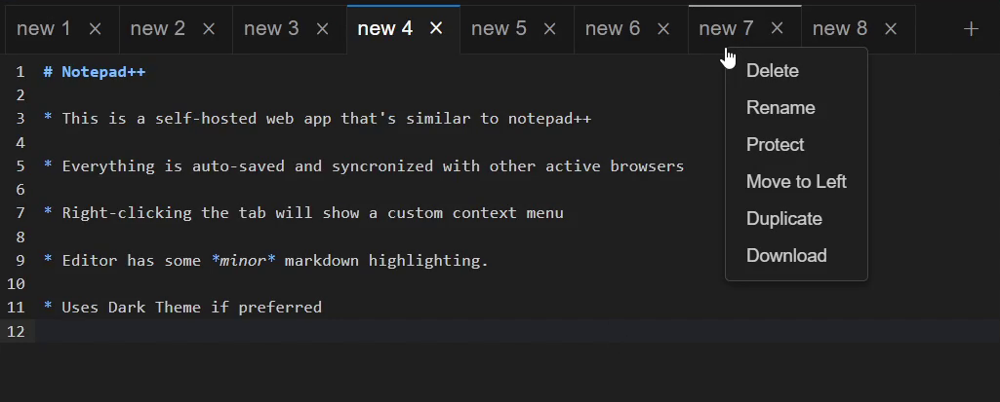

# Notepadtt

A simple notepad app similar to notepad++. Notes are auto-saved and synchronized in real time. Written in .NET and Angular, and heavily utilizes SignalR. 

<p align="center">
  <br>
    
  <br>
</p>

# Installation

This app is intended to be run with docker. The simplest usage is
```
docker run -p 8080:8080 joshtxdev/notepadtt
```
The data will save to the container's filesystem, which is probably fine for most use cases. 

Optionally, you can mount a docker volume (or host filesystem path) to the containers's `/data` directory
```
docker run -p 8080:8080 -v notepadVolume:/data joshtxdev/notepadtt
```
if mounting a filesystem path, make sure you have correct file permissions set up. 

Lastly, you can specify a `title` environmental variable to set the HTML's `<title>`, giving the browser tab an alternate title.  
```
docker run -p 8080:8080 -e "title=temp notes" joshtxdev/notepadtt
```

# Usage

The UI is extremely minimalistic. Each file has its own tab. Right-clicking a tab will show a context menu with various actions. The `+` icon in the top right creates a new file, and the tab's `×` icon will delete the file. Because the files are deleted rather than closed, there are 2 features to mitigate accidental data loss:

1. Deleting a file will briefly display a prompt at the bottom of the screen to `UNDO` the delete.
2. You can right click a tab and choose to `protect` the file. This hides the tab's `×` icon, and the context menu's `delete` option will ask for confirmation before deleting. 

Files that were not created by the app (this can happen when mounting to `/data`) will initially be `protect`ed.
All actions (typing, pasting, changing the active tab, renaming a file, etc.) immediately save to the server and synchronize with all other active browser connections. The notepad is mediocre at handling simultaneous writes to the same file (There usually isn't data loss, but the cursor may jump around unexpectedly). All other synchronizations work very well. 


